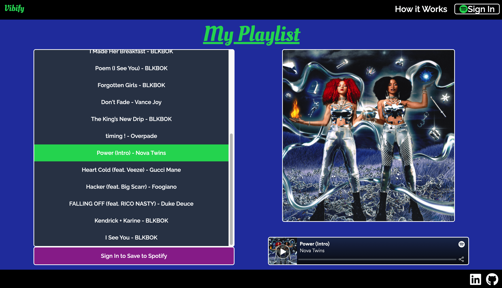
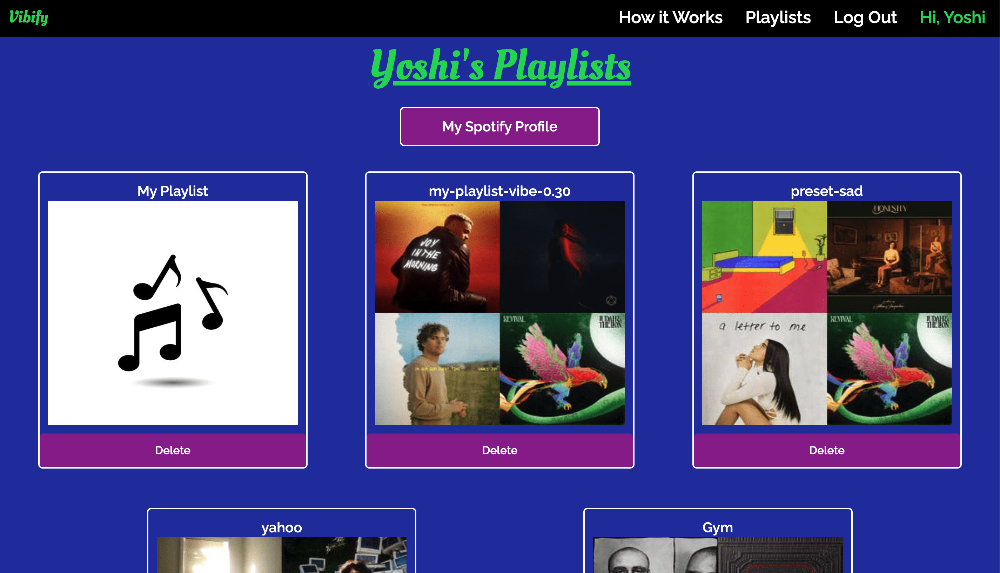

# Vibify

## Project Description

Vibify is a full-stack application that allows users to generate a Spotify playlist of songs based on an indicated mood. The name is a combination of "vibe" and "Spotify"!

### Technologies Used

- Front End: JavaScript, Tailwind CSS
- Back End: Python (Flask) | Flask-WTForms | SQLAlchemy | PostgreSQL | Flask-Migrate

### API

- <a href="https://developer.spotify.com/documentation/web-api/quick-start/" target="_blank">Spotify Web API</a>

## How it Works

The back-end is implemented with Flask. Once a user submits the playlist form or clicks on one of the preset vibes,
requests are made to the <a href="https://developer.spotify.com/documentation/web-api/quick-start/">Spotify Web API</a>
to retrieve tracks from the newest albums on Spotify.

The resulting tracks are then filtered out to match the vibe set by the user - 0.0 indicates a "sad" vibe while 1.0 indicates a "happy" vibe. The "valence" attribute of each track
(a measure from 0.0 to 1.0 that describes the musical positiveness of a track) are used to determine whether the track matches the
user's vibe.

The resulting group of tracks are then rendered using Jinja, with JavaScript handling user interactions with the playlist (i.e.
saving the playlist to Spotify or updating the album image and player to correspond with track selection).

Users have the option to generate playlists whether or not they are signed in with their Spotify account. Spotify sign-in authorization was implemented by following the <a href="https://developer.spotify.com/documentation/general/guides/authorization/code-flow/">Authorization Code Flow</a>. The <a href="https://developer.spotify.com/documentation/general/guides/authorization/client-credentials/">Client Credentials Flow</a> was also implemented to allow requests to be made to the Spotify API without authorization. No third party libraries were used in implementing these flows.

## Main Features

- **Playlist creation through form input (All users)**

  - Any user can generate a playlist through this form, regardless of login status
    

  - Non-signed in users can play a 30-second preview of the song
    
  - Signed in users can play the entirety of the song and add the playlist to their Spotify account
    

- **One-click playlist creation with a preset vibe (All users)**

  - A playlist can also be generated by selecting one of these preset vibe options
    

- **User's Playlists Page (Signed in users only)**

  - Lists every playlist on the user's Spotify account
  - Option to delete the playlist from the user's Spotify account within the app
  - Displays a button to open the user's Spotify account page
    

- **Informational Section**

  - Concisely describes how a user can create a playlist (through form input or through one of the presets)
  - Emphasizes that a playlist can be created by any user, signed in or not
    

  

## Standard User Flow

1. A user lands on the homepage and signs into their Spotify account by clicking the "Sign In" button.
2. After successful authorization with Spotify, the user is redirected to the homepage.
3. They enter a playlist name, sets their "vibe", and clicks the Generate button or selects one of the preset playlists.
4. The user can listen to the songs in the generated playlist and add the playlist to their Spotify account.
5. Upon adding the playlist to their Spotify account, they are redirected to the Playlists page, where they can see a list of all playlists on their Spotify account. Users have the option to delete a playlist directly from the Playlists page.

