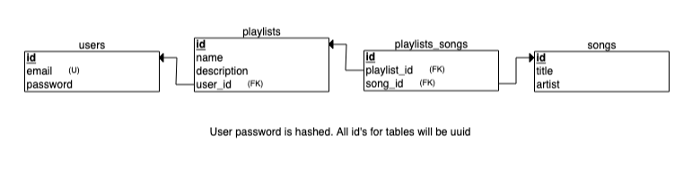

# Vibify

## Overview:

The goal of this app is to allow music listeners to generate a Spotify playlist of songs based on the user’s indicated mood.

The user demographic will include:

- Music fans
- Spotify users (though not required)

## Tools:

Flask | Jinja | PostgreSQL

## Data Sources:

The main source of the data will be provided by the [Spotify API](https://developer.spotify.com/documentation/web-api/). Some useful endpoints are:

- ”Get User’s Top Items” / “Get Followed Artists” / “Get Featured Playlists” / “Get New Releases” - may be potential pools of songs from which playlists are created
- “Get Tracks’ Audio Features” - each track has features that can be used to determine its perceived mood / energy (Danceability, Energy, Tempo, Valence)
- “Create Playlist” - create the playlist based on songs determined to fit user mood

## Database Schema:

- users
  - id: TEXT, PK (uuid)
  - email: VARCHAR(50), unique
  - password: TEXT (hashed)
- playlists
  - id: TEXT, PK (uuid)
  - name: VARCHAR(25)
  - description: VARCHAR(100)
  - user_id: TEXT, FK
- songs
  - id: TEXT, PK (uuid)
  - title: VARCHAR(50)
  - artist: VARCHAR(50)
- playlists_songs
  - playlist_id: TEXT, FK
  - song_id: TEXT, FK

## Potential API Issues:

- Spotify has a rate limit that is calculated based on the number of calls to its API within a rolling 30 second window. A few endpoints also have custom rate limits that differ from the API-wide rate limit. Rate limit not specified.
  - Solution: cache data for a certain amount of time to minimize requests using Memcached.

## Sensitive Information:

- Hashed passwords will be stored for the user model.

## Functionality:

- Non-registered users:
  - Ability to view auto-generated playlists based on example moods.
  - Can generate a song playlist based on their mood.
- Additional Features for Registered users:
  - Can save the generated playlist to their own Spotify account after Spotify login.
  - Maybe: allow playlist songs to be played in the app.

## User Flow:

I. Landing page

- Auto-generated playlists based on example moods
- Slider (or something) to indicate mood / energy (sad, neutral, happy, etc.)
- Textbox to add a name for the playlist
- Button to generate the playlist
- Link to register/login

II. Playlist page / tab?

- Displays playlist & songs within the playlist
- Displays user created playlist title
- Displays button to add the playlist to user Spotify account, if user is logged in

## Additional Considerations

1. Allow users to save generated playlists in the app
2. Allow users to change username / password
3. Playlist creation based on user mood and additional specifications (specific genre, artist, etc.)
